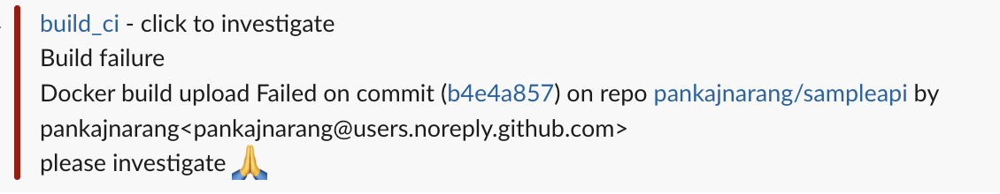

# sampleapi
sample test api

Process to follow to contribute to code

#1 Push your changes in a separate branch and create a pull request
#2 We have a test action defined on Pull request.
#3 Owner should approve the changes
#4 Once approved, the code can be merged to main (stable) branch
#5 There's a build action defined on merge to main which is responsible to build a docker image and push this to my docker hub repository
#6 In case of failures, a slack message will be sent to its respective channel.

